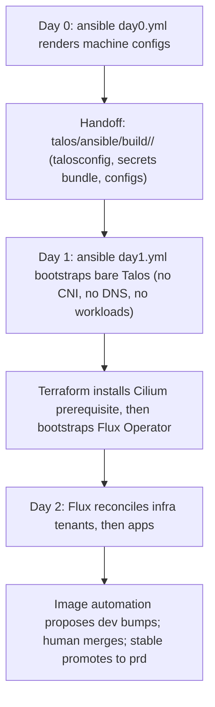
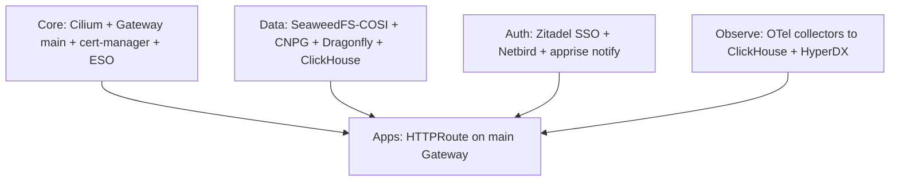

# HomeOps

Private-cloud GitOps homelab: bare-metal [Talos Linux](talos/) machines on Day 0/1,
everything inside Kubernetes delivered by [FluxCD](flux/) on Day 2, with
first-party [Go services and charts](projects/) consumed as versioned artifacts.
One direction only: `talos/` renders machines, `flux/` delivers workloads,
`projects/` supplies the images and charts Flux deploys.

## Repository layout

| Directory | Layer | What lives there |
|---|---|---|
| [`talos/`](talos/README.md) | Day 0/1 — machines | Per-cluster machine configs (`clusters/_base` + one dir per cluster, per-node `nodes/<name>/` overrides), rendered and bootstrapped by Ansible |
| [`talos/ansible/`](talos/ansible/README.md) | Day 0/1 — automation | Three playbooks: `day0.yml` (render), `day1.yml` (bootstrap), `day2.yml` (operate); full procedure in [`RUNBOOK.md`](talos/ansible/RUNBOOK.md) |
| [`flux/infra/`](flux/infra/README.md) | Day 2 — platform | ~22 shared platform components (`controllers/` + `configs/`, `base` + `dev`/`prd` overlays) |
| [`flux/apps/`](flux/apps/README.md) | Day 2 — workloads | 8 user-facing apps on the same base/overlay shape; each `dependsOn` infra |
| [`flux/fleet/`](flux/fleet/README.md) | Day 2 — wiring | Per-cluster tenant wiring, update automation (`ResourceSet` + `ImageUpdateAutomation`), Terraform bootstrap of the Flux Operator |
| [`projects/`](projects/) | Sources | Go services (`apprise-go-api`, `eso-proton-pass`, `external-dns-netbird`) and the `helm-rclone-sync` chart — published as images/charts, consumed by Flux only |
| [`.github/`](.github/WORKFLOW.md) | CI | Per-path validation and release workflows |
| [`scripts/`](scripts/) | Docs tooling | Manual reference-docs refresh (`fetch-references.sh`) |

Conventions, pins, and contribution rules live in [`AGENTS.md`](AGENTS.md).
Machine inventory (clusters, nodes) lives under `talos/` — hardware specifics stay
there, not here.

## End-to-end lifecycle



**Day 0 — render.** `ansible-playbook talos/ansible/playbooks/day0.yml -e
talos_cluster=<cluster>` renders machine configs into the gitignored handoff
`talos/ansible/build/<cluster>/` (talosconfig, secrets bundle, per-node configs).

**Day 1 — bootstrap.** `day1.yml` boots bare Talos and fetches kubeconfig. Machine
config is deliberately bare: no CNI, no DNS, no workloads, no telemetry.

**Day 2 — GitOps takes over.** Terraform (under `flux/fleet/terraform/`) installs
Cilium as a prerequisite, then provisions the Flux Operator — the only writer of
cluster state. From there every deployment flows from git: tenant `ResourceSets`
(5m) fan out to `Kustomizations` (30m); tenant `OCIRepositories` sync every 5m,
chart `OCIRepositories` every 1h. Apps declare `dependsOn` infra and wait for
`Ready`.

**Promotion: dev soaks, stable ships.** First-party images publish `dev` and
`stable` tracks. Image automation (`ImageRepository` scan 12h +
`ImageUpdateAutomation` 30m with Setters) opens `image-updates-*` branches against
dev; a human merges; dev greens first, then `stable` promotes to prd. The
`helm-rclone-sync` chart is the exception: bumped atomically by hand (Chart version
+ all consumer pins together, no image policy).

## Core platform

What `flux/infra/` guarantees before any app lands:

- **Network / edge.** Cilium eBPF dataplane (kube-proxy replacement, Gateway API
  datapath, Hubble observability, LB + L2 announcements). A single shared `main`
  Gateway (Cilium class): `:80` redirects to `:443`, `:443` terminates TLS with
  per-namespace wildcard certificates. No Ingress anywhere; Gateway API only.
- **Secrets / TLS.** External Secrets with a shared `proton-pass`
  `ClusterSecretStore` (refresh 1h); secrets are addressed as
  `pass://<cluster>/<namespace>/<field>` and land as ordinary Kubernetes Secrets.
  cert-manager `letsencrypt` ClusterIssuer mints the wildcards via Cloudflare
  DNS-01. Talos-level secrets use `pass://<cluster>/talos/<field>`.
- **Data.** S3 via SeaweedFS claimed per-bucket through COSI (`Claim` + `Access`
  per bucket), each backed up to Proton Drive by a `helm-rclone-sync` cron.
  Postgres via CloudNativePG (S3 backups), Redis API via Dragonfly, Mongo API via
  FerretDB backed by CNPG, analytics via the Altinity ClickHouse operator (S3
  backups). Local-path storage covers single-node volumes.
- **Auth / access.** Zitadel is the SSO source of truth (native OIDC where the
  app supports it, `oauth2-proxy` in front where it does not). Clusters stay
  private behind a Netbird mesh (Ansible-managed root side, Terraform CRs
  in-cluster). Notifications fan out through `apprise-go-api` to Matrix rooms.
- **Observability.** ClickHouse-native: the OTel operator + collectors ship
  telemetry to ClickHouse, HyperDX is the UI. No Prometheus/Grafana. Rules and
  endpoint conventions live in [`flux/OBSERVABILITY.md`](flux/OBSERVABILITY.md).
- **Updates.** Images and charts update themselves: an update policy per component
  (`ImageRepository` + semver `ImagePolicy`) plus a `# {"$imagepolicy":...}`
  marker at each consumption site. Automation proposes, humans merge.
- **Supporting cast.** tofu-controller (the in-cluster Terraform runner:
  `approvePlan: auto`, `destroy: false`), VPA, metrics-server, CoreDNS, Multus,
  KubeVirt, external-dns-netbird sidecar.

Workload standards apply everywhere: health checks and requests/limits on every
Deployment, HPA for stateless (dev 1–2, prd 2–4), singletons for stateful unless
an operator makes HA safe, VPA `Off` alongside HPA / `Initial` for singletons.

## How apps consume the platform



An app is a thin layer over platform contracts:

1. **Expose** with its own `HTTPRoute` parented to the shared `main` Gateway —
   never Ingress, never FQDNs for in-cluster traffic.
2. **Secrets** via `ExternalSecret` through the shared `ClusterSecretStore`
   (refresh 1h); TLS comes free from the namespace wildcard Certificate.
3. **State** via a COSI `Claim` (+ `Access`) for S3, CNPG `Cluster` for Postgres,
   Dragonfly/FerretDB/ClickHouse operators above that — each with its
   `helm-rclone-sync` backup cron.
4. **Login** via Zitadel OIDC (native or `oauth2-proxy` sidecar); **alerts** via
   `apprise-go-api` webhooks to Matrix.
5. **Images** carry `$imagepolicy` markers so update automation tracks them;
   every Flux YAML wrapping a local project comments back to its `projects/`
   source path.

Component shapes differ slightly: most infra components are
`controllers/` + `configs/` with `base` + `dev`/`prd` overlays (base holds
placeholders, overlays hold the difference); Netbird's controllers are an empty
shell over a shared Terraform root, and OTel collectors are operator CRs rather
than HelmReleases.

## Operations

```bash
# Talos Day 0/1/2 (replace <cluster> with a directory under talos/clusters/)
ansible-playbook talos/ansible/playbooks/day0.yml -i localhost, -e talos_cluster=<cluster>
ansible-playbook talos/ansible/playbooks/day1.yml -i localhost, -e talos_cluster=<cluster>
ansible-playbook talos/ansible/playbooks/day2.yml -i localhost, -e talos_cluster=<cluster> --check --diff

# Flux validation, one scope at a time
flux/scripts/validate.sh -d flux/infra
flux/scripts/validate.sh -d flux/apps
flux/scripts/validate.sh -d flux/fleet
```

- Never `kubectl apply` / `helm upgrade` against a cluster directly — only the
  Terraform-bootstrapped Flux Operator mutates state.
- CI mirrors the gates per path (Go vet/build/test + lint, Helm lint/template,
  per-scope Flux validation, Tofu validate/test); see [`.github/WORKFLOW.md`](.github/WORKFLOW.md).
- Toolchain source of truth is `.flox/env/manifest.toml`; refresh local reference
  docs by hand with `scripts/fetch-references.sh -m zip`.
- Start with [`AGENTS.md`](AGENTS.md), then [`talos/ansible/RUNBOOK.md`](talos/ansible/RUNBOOK.md)
  §§0–6 for machines and the `flux/*/README.md` files for the platform.

## License

Apache-2.0 — see `LICENSE`, with attribution notices in `NOTICE`
(© 2026 Andriyansyah Nurrachman).
